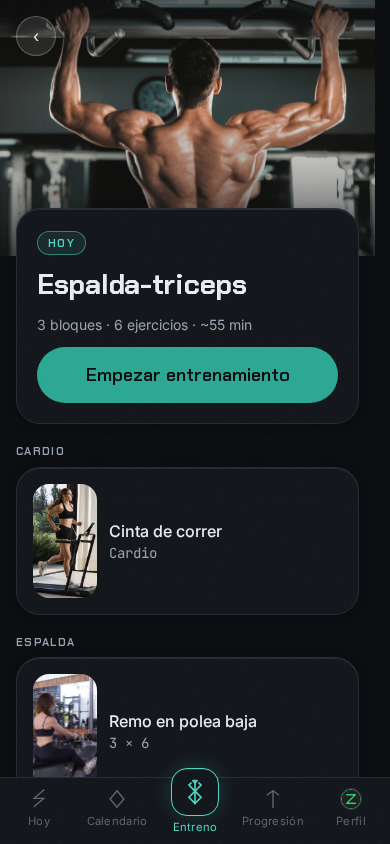
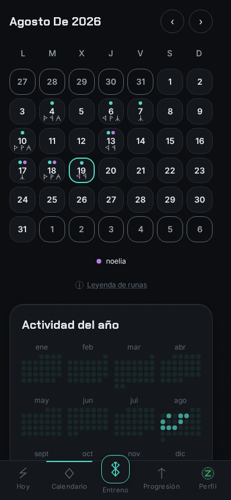
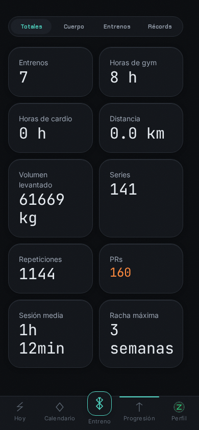
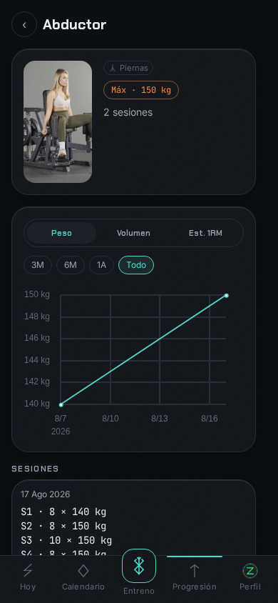

<p align="center">
  
</p>

<!-- Elder Futhark: ᛒ(b) ᛖ(e) ᚱ(r) ᛋ(s) ᛖ(e) ᚱ(r) ᚲ(k) -->
<h1 align="center">ᛒᛖᚱᛋᛖᚱᚲ</h1>

<p align="center">
  Self-hosted workout tracker. Plan it, log it, watch the runes light up.
</p>

<p align="center">
  <a href="https://github.com/zurdi15/berserk/actions/workflows/ci.yml"></a>
  <a href="https://github.com/zurdi15/berserk/releases"></a>
  <a href="LICENSE"></a>
</p>

Berserk is a self-hosted, multi-user workout tracker: plan sessions on a calendar, log sets live with a rune for every muscle group, and watch personal records and long-term progress build up. It ships as a single non-root Docker image (FastAPI + SQLite + a Vue PWA), with an optional Android shell and Wear OS companion for native timers on your phone and wrist.

## Features

- **Planning calendar** — schedule sessions ahead of time and see them alongside what you actually trained.
- **Retroactive workouts** — log a past session straight from the calendar, or edit any past workout's sets, exercises, tags, feeling, note and even its date and time, with personal records dated correctly.
- **Per-muscle-group logging with runes** — every muscle group and routine carries its own glyph from a full Elder Futhark set, tagged live as you log a session.
- **Live PR detection** — top weight, volume and estimated 1RM records are flagged the moment you beat them, mid-set.
- **Progress analytics** — a lifetime stats tab (hours, volume, streaks and more), trend charts per exercise, a full PR history, muscle-group distribution and body-metric tracking.
- **Custom, accessible form pickers** — a filterable select, a time field and a mini-calendar date field replace every native input, all fully keyboard-operable.
- **Admin backup and restore** — export a consistent snapshot of the database as a zip with an integrity manifest, and restore it atomically with a safety fallback.
- **Multi-user read sharing** — grant another account read access to your training so a coach or training partner can follow along.
- **Invite-only signup** — no public registration; new accounts are created from single-use invite links issued by an admin.
- **PWA** — installable, works offline for the shell, no app store required.
- **Push alerts on iPhone** — no iOS app needed: install the PWA to the Home Screen (Share → Add to Home Screen), turn on *Alerts on this device* in Settings, and the rest/cardio end notification arrives through Web Push even with the app closed. The server generates its VAPID keys on first start (`vapid.pem` in the data dir); `BK_PUSH_ENABLED=false` turns it off.
- **Android shell & Galaxy Watch app** — an optional Android APK (system-rendered rest/cardio/workout timers, exact end-of-rest alarm) and a Wear OS companion that shows the running countdown on the watch face and buzzes your wrist at zero — no store, no account, just two APKs signed with the same key.
- **ES/EN** — full Spanish and English UI.
- **kg/lb** — per-user unit preference, converted consistently across logging, history and charts.

## Screenshots

<table align="center">
  <tr>
    <td></td>
    <td></td>
    <td></td>
  </tr>
  <tr>
    <td></td>
    <td></td>
    <td></td>
  </tr>
</table>

## Quick start

```yaml
services:
  berserk:
    image: ghcr.io/zurdi15/berserk:latest
    ports: ["8000:8000"]
    volumes: ["berserk-data:/data"]
    restart: unless-stopped
volumes:
  berserk-data:
```

```
docker compose up -d
```

Open `http://localhost:8000`. There's no public signup: **the first account you create becomes the admin**, and from then on every new user needs an invite link generated from the admin panel. The commented compose file is [examples/docker-compose.yml](examples/docker-compose.yml).

## Configuration

All settings are environment variables with the `BK_` prefix.

| Variable | Default | Description |
|---|---|---|
| `BK_DATA_DIR` | `/data` | Data directory: the SQLite database (`berserk.db`) and the generated `vapid.pem` |
| `BK_SESSION_TTL_DAYS` | `30` | Session lifetime; it renews itself while the app is in use |
| `BK_COOKIE_SECURE` | `false` | Mark the session cookie as `Secure` (enable behind HTTPS) |
| `BK_INVITE_TTL_HOURS` | `72` | How long the invite links issued by the admin stay valid |
| `BK_PUSH_ENABLED` | `true` | Web Push for rest/cardio end alerts (VAPID keys are generated on first start) |
| `BK_VAPID_SUBJECT` | `mailto:contact@zurdi.dev` | Contact the push services see in the VAPID JWT — set your own |
| `BK_SERVE_STATIC` | `true` | Serve the SPA (disable only in dev) |

### Data

Everything the app stores lives under `/data`: the SQLite database and the push keys. The container runs as a dedicated non-root user, and `/data` must be writable by it. A named volume, like `berserk-data` above, gets the right ownership automatically. If you use a bind mount instead (e.g. `./data:/data`), `chown` the host directory to the container's uid first, or the app won't be able to write its database.

Backups are made from the admin panel: it exports a consistent snapshot of the database as a zip with an integrity manifest, and restores it atomically with a safety fallback.

### Reverse proxy & authentication

Berserk has its own login and is invite-only: no public registration, the first account is the admin, and every other account is created from a single-use invite link. Set `BK_COOKIE_SECURE=true` when serving over HTTPS.

The container's entrypoint runs uvicorn with `--proxy-headers`, but by default it only trusts `X-Forwarded-*` headers from loopback. If you're putting berserk behind nginx, Traefik, Caddy, etc., set `FORWARDED_ALLOW_IPS` to the proxy's address (or `*` if it's trusted infrastructure) so redirects and client IPs resolve correctly:

```yaml
    environment:
      FORWARDED_ALLOW_IPS: "*"
```

## Android shell and Wear OS app

Every release ships two optional APKs next to the Docker image, built and signed by CI:

- `berserk-vX.Y.Z.apk` — the Android shell ([mobile/](mobile/)): a WebView against your server plus native extras the PWA can't do (system-chronometer notifications for rest, cardio and workout time, an exact end-of-rest alarm, and the Wear OS bridge). Install it directly or through Obtainium; it tells you when a newer APK exists.
- `berserk-wear-vX.Y.Z.apk` — the Galaxy Watch / Wear OS app ([mobile/wear/](mobile/wear/)): the phone publishes each timer to the Wear OS Data Layer and the watch renders it as an ongoing activity on the watch face, with a full-screen countdown and a wrist vibration at zero. It needs the shell on the phone and is installed over ADB Wi-Fi — see [mobile/wear/README.md](mobile/wear/README.md).

## Development

Requirements: [uv](https://docs.astral.sh/uv/) and Node 22+.

```bash
./dev.sh          # backend :8000 + frontend :5173, both with hot reload
./dev.sh --seed   # same, seeding realistic synthetic history on first run
```

```
backend/    FastAPI · SQLAlchemy 2 · Alembic · SQLite
frontend/   Vue 3 · Vite 7 · TypeScript · Pinia · Tailwind 4 · PWA
mobile/     Android shell (WebView + native timers) and the Wear OS companion
Dockerfile  multi-stage: frontend build → python runtime, single non-root image
```

Use the app at `http://localhost:5173`; the API and its docs live at `http://localhost:8000/api/docs`. Tests: `cd backend && uv run pytest` · `cd frontend && npm test`.

## Credits

- Muscle-map artwork (front/back muscular system and per-muscle overlays) from the [wger project](https://github.com/wger-project/wger), licensed [CC-BY-SA 3.0](https://creativecommons.org/licenses/by-sa/3.0/).
- Exercise image search powered by [free-exercise-db](https://github.com/yuhonas/free-exercise-db) (public domain).

## License

MIT — see [LICENSE](LICENSE).
