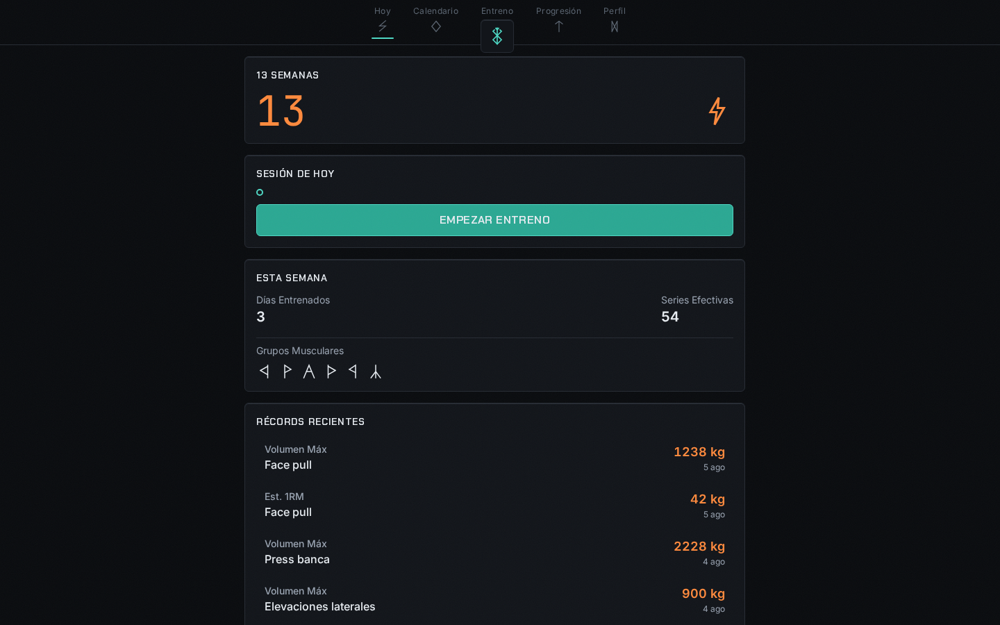
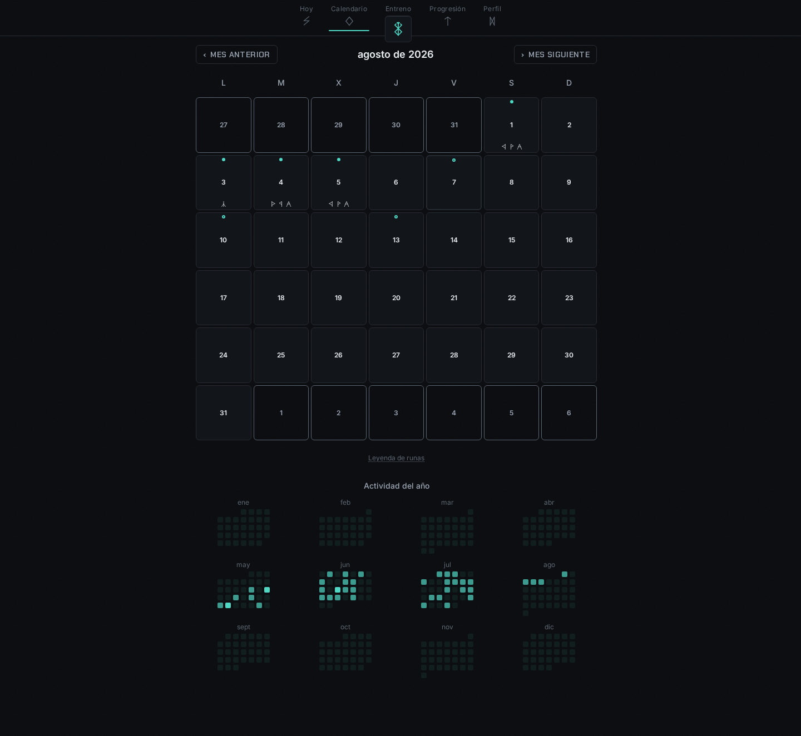
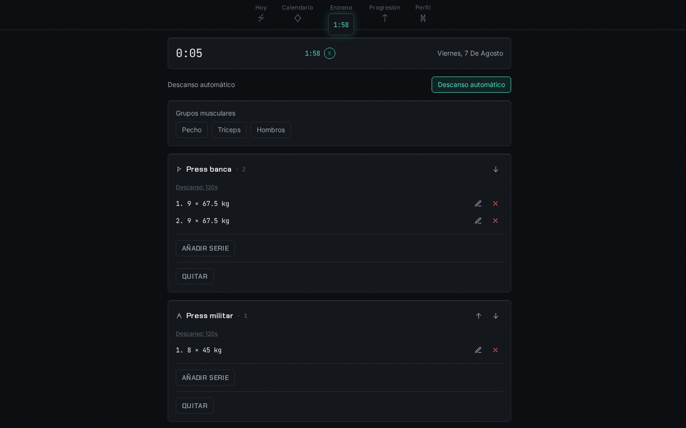
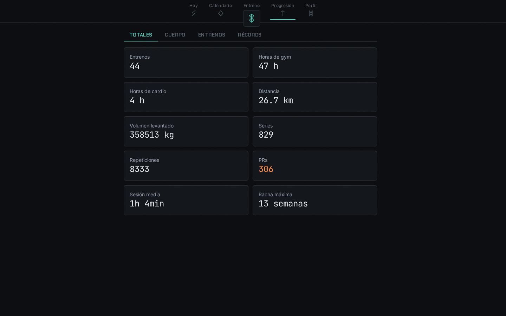
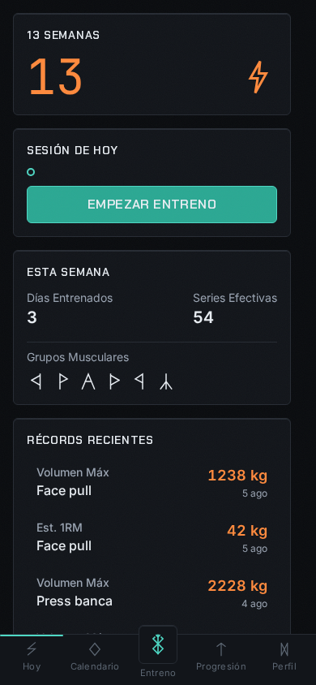
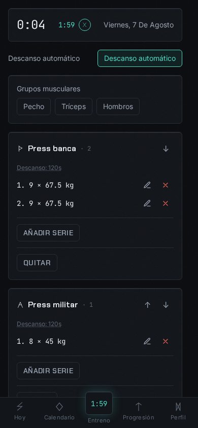

# berserk

Self-hosted workout tracker. Plan it, log it, watch the runes light up.

[](https://github.com/zurdi15/berserk/actions/workflows/ci.yml)
[](https://github.com/zurdi15/berserk/releases)

## Screenshots

<p align="center">
  
</p>

<table>
  <tr>
    <td></td>
    <td></td>
    <td></td>
  </tr>
</table>

<table>
  <tr>
    <td></td>
    <td></td>
  </tr>
</table>

## Features

- **Planning calendar** — schedule sessions ahead of time and see them alongside what you actually trained.
- **Retroactive workouts** — log a past session straight from the calendar, or edit any past workout's sets, exercises, tags, feeling, note and even its date and time, with personal records dated correctly.
- **Per-muscle-group logging with runes** — every muscle group and routine carries its own glyph from a full Elder Futhark set, tagged live as you log a session.
- **Live PR detection** — top weight, volume and estimated 1RM records are flagged the moment you beat them, mid-set.
- **Progress analytics** — a lifetime stats tab (hours, volume, streaks and more), trend charts per exercise, a full PR history, muscle-group distribution and body-metric tracking.
- **Custom, accessible form pickers** — a filterable select, a time field and a mini-calendar date field replace every native input, all fully keyboard-operable.
- **Admin backup and restore** — export a consistent snapshot of the database as a zip with an integrity manifest, and restore it atomically with a safety fallback.
- **Multi-user read sharing** — grant another account read access to your training so a coach or training partner can follow along.
- **Invite-only signup** — no public registration; new accounts are created from single-use invite links issued by an admin.
- **PWA** — installable, works offline for the shell, no app store required.
- **ES/EN** — full Spanish and English UI.
- **kg/lb** — per-user unit preference, converted consistently across logging, history and charts.

## Quickstart

```yaml
services:
  berserk:
    image: ghcr.io/zurdi15/berserk:latest
    ports: ["8000:8000"]
    volumes: ["berserk-data:/data"]
volumes:
  berserk-data:
```

```
docker compose up -d
```

Open `http://localhost:8000`. There's no public signup: **the first account you create becomes the admin**, and from then on every new user needs an invite link generated from the admin panel.

### A note on the data volume

The container runs as a dedicated non-root user, and `/data` (where the SQLite database lives) must be writable by it. A named volume, like `berserk-data` above, gets the right ownership automatically. If you use a bind mount instead (e.g. `./data:/data`), `chown` the host directory to the container's uid first, or the app won't be able to write its database.

### Running behind a reverse proxy

The container's entrypoint runs uvicorn with `--proxy-headers`, but by default it only trusts `X-Forwarded-*` headers from loopback. If you're putting berserk behind nginx, Traefik, Caddy, etc., set `FORWARDED_ALLOW_IPS` to the proxy's address (or `*` if it's trusted infrastructure) so redirects and client IPs resolve correctly:

```yaml
    environment:
      FORWARDED_ALLOW_IPS: "*"
```

## Development

```
git clone https://github.com/zurdi15/berserk.git
cd berserk
./dev.sh --seed
```

This starts the backend on `:8000` and the frontend (Vite, hot reload) on `:5173`, seeding realistic synthetic history on first run. Use the app at `http://localhost:5173`; the API and its docs live at `http://localhost:8000/api/docs`.

## Stack

FastAPI + SQLAlchemy/Alembic on SQLite for the backend, Vue 3 + TypeScript + Tailwind for the frontend, shipped as a single non-root Docker image.
